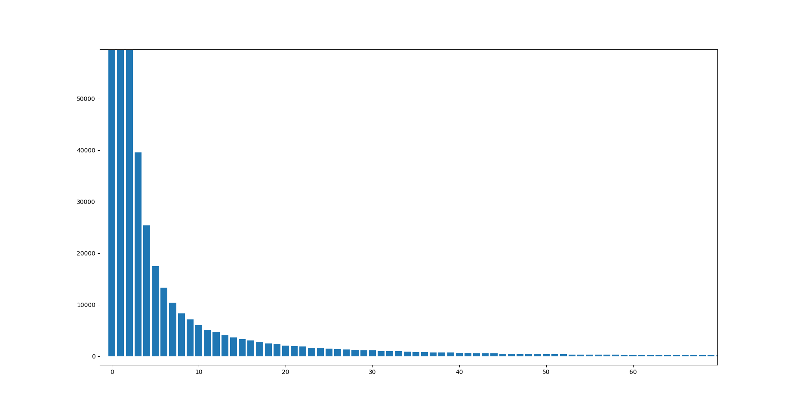

# Diary

## 16/05/2020 - Setup the project

### Tools

I never used **git** or **GitHub** before, I will use [these convetions](https://www.conventionalcommits.org/en/v1.0.0/) to write the commits.

Markdown is a standard on GitHub, so I am writing this diary on **markdown**.

### Database and Unix Commands

The database size is very high, about 7 GB, I will use the command **head** to extract the little part of the database.

Specifically, I think that the first 2k lines are enough for the sample.
```bash
head -2000 db.m4 > sample.m4
```

I am planning to use the *head* command again to split the database in little parts and **run the script in parallel**.

### Preprocessing

The database is very high, with the sample extracted using the **head** command I can work on it.  
How? I think to work on a preprocessing step which will filter all the useless data to reduce more the database size and extract only the part of the sample that will be used to build the first graph sample.

The script consists of extracting the part of the database which contains only the interesting overlaps.

Moreover, during the preprocessing could be useful to add a new column "ID" to define a key which will be the vertex of the graph.


### Post-preprocessing

I didn't have any issue about RAM or any needs to parallel the preprocessing.java script to filter the database.
The filtered database is **2.6 GB**, I hope to have no issues when I will use it to build the graph.


## 16/05/2020 - minor improvements and starting the graph

I need to improve the **preprocessing step** creating a "converter" for the identifiers to integers.


## 17/05/2020 - reuse Graph and GraphIO classes

I think that we can use the classes GraphIO and Graph as code base, so I will improve the preprocessing script to generate an adjacency list in a text file, so a file with only IDs.

## 22/05/2020 - degree distribution

Extracted the values of the degree distribution, I can see that they are really small with the sample database. Probably, they will be smaller using the biggest one.

The **maximum degree** is **968**.  
Several node degree is about **1/968**, because several nodes have only one edge.
There are **8 million of nodes** and **22 million of edges**.

I get the guess about the node degree distribution average plotting the degree distribution of a sample (db), using **show_degree_dist.py**, just to view the data in a better way.


## 23/05/2020 - component graph

Investigating about DFS vs BFS complexity they seem really the same, they are equivalent, but about the graph structure and the average cases the DFS seems to be faster than BFS.

Probably, if I need to find a node in a graph where there are several graph components and these components are strongly conneccted (like in a social network), the BFS is better to find this node.
In reverse, if I need to find a "lonely node" which is not connected to others, DFS could be the better solution.

Moreover, DFS generally requires less memory than BFS, in this case I need to work on a really big graph, so DFS is a good choice.

Well, about the current graph, we have the following degree distribution.

| degrees prob. | nodes   | 
|---------------| ------- |
| 0.0           | 7976587 |
| 0.1           | 61011   |
| 0.3           | 11738   |
| 0.2           | 30308   |
| 0.4           | 3466    |
| 0.6           | 301     |
| 0.5           | 716     |
| 0.7           | 210     |
| 0.8           | 88      |
| 0.9           | 28      |
| 1.0           | 5       |

**Note:** with **"0.0"** I count all the nodes with degree prob. **0.0*** value.

So, probably the nodes are not so strongly connected, indeed, the DFS also under this aspect seems to be the choice for this.


## 26/05/2020 - component graph

---  

I tried the DFS algorithm recursively, it worked with the sample, but I met the **stackoverflow** error with the entire DB, so I implemented an iterative one.

### Benchmark / Case-study about the efficiency

Tests with sample database:

|   #     | BFS       | DFS     |
|---------|-----------|---------|
| time    | 3 ms      | 3 ms    |
| memory  | 5424712   | 5424688 |  


Tests with the entire database:

|   #     | BFS          | DFS     |
|---------|--------------|---------|
| time    | 6037 ms      |  |
| memory  | 3554873344   |  |  


### Data results

Number of components: 961874  
Components size (in the graph)  




In the graph are showed the component graph with 1 as size to 60+ size.  
As a result, we can evince that the most components have 1-3 as size, more is the size less graph component we have in the graph.  
All the graph component size is stored in **component_size_entire_DB.txt**.

